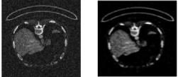
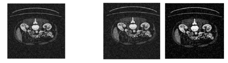

# 🧠 Medical Imaging Denoising

[](LICENSE)  
[](https://www.python.org/) [](https://www.tensorflow.org/) [](https://keras.io/)  

This project explores **image denoising techniques** for medical imaging, with a focus on **pancreatic tumor CT scans**. It compares:  

- 🧠 **Deep Learning (Convolutional Autoencoder)**  
- 📈 **Classical Machine Learning (Ridge Regression + Frequency-Domain Deconvolution)**  

The goal is to enhance noisy medical images, improving diagnostic quality and AI model performance.

---

## 📂 Project Structure


---

## 🖋️ Overview

This repository implements and compares two denoising strategies:  

1. 🧠 **Convolutional Autoencoder**  
   - A neural network trained end-to-end to reconstruct clean images from noisy CT scans.  
2. 📈 **Ridge Regression + Deconvolution**  
   - A classical approach enhanced with median filtering.  

Both methods are evaluated on a dataset of **pancreatic tumor images** with synthetic Gaussian noise.

---

## 🚀 Denoising Methods

### 🧠 Autoencoder (Deep Learning)

A convolutional neural network trained with noisy images as input and clean images as targets.

- **Encoder**: Stacked Conv2D layers (ReLU activations, padding='same')  
- **Decoder**: Stacked Conv2DTranspose layers  
- **Loss Function**: Mean Squared Error (MSE)  
- **Optimizer**: Adadelta  

📂 Implemented in:
- `Autoencoder/model.py`
- `Autoencoder/denoising1.ipynb`

**Example result:**


---

### 📈 Ridge Regression + Deconvolution (Classical ML)

A two-step process:  
1. **Ridge Regression** predicts pixel intensities.  
2. **FFT-based Deconvolution** removes residual blur.  
3. **Median Filtering** smooths artifacts.  

📂 Implemented in:
- `Regressione-Deconvoluzione/denoising2.ipynb`

**Example result:**


---

## 📊 Results

All methods are evaluated using the following metrics:  

- **PSNR (Peak Signal-to-Noise Ratio)**  
- **SSIM (Structural Similarity Index)**  
- **MSE (Mean Squared Error)**  

**Comparison plot:**


| Technique                     | PSNR ↑   | SSIM ↑   | MSE ↓    |
|-------------------------------|----------|----------|----------|
| Noisy Input                   | 18.4 dB  | 0.65     | 0.012    |
| CNN Autoencoder               | 28.2 dB  | 0.92     | 0.002    |
| Ridge + Median Filter         | 24.1 dB  | 0.85     | 0.006    |
| Deconvolution + Median Filter | 26.3 dB  | 0.88     | 0.004    |

---
## 💻 Getting Started

### 📝 Clone the repository
```bash
git clone https://github.com/<your-username>/medical-imaging-denoising.git
cd medical-imaging-denoising
```

### 📝 Install dependencies
```bash
pip install -r requirements.txt
```

### 📝 Run the notebooks
```bash
cd Autoencoder
jupyter notebook denoising1.ipynb

cd ../Regressione-Deconvoluzione
jupyter notebook denoising2.ipynb
```

## 📜 License

This project is licensed under the MIT License - see LICENSE.

## 👨‍💻 Author

Giovanni Previtera
📧 Email
🌐 GitHub


